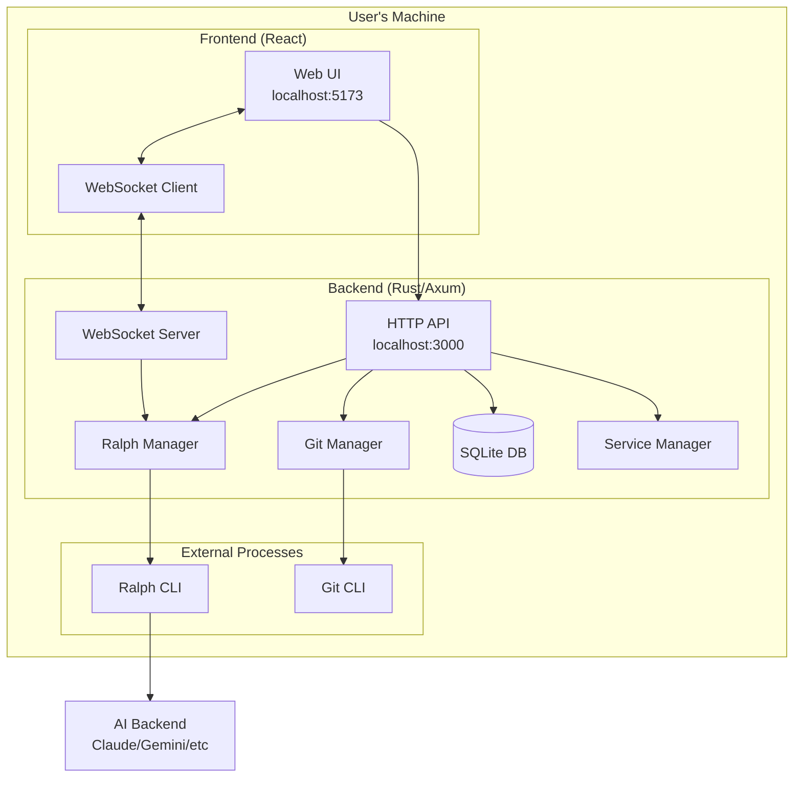
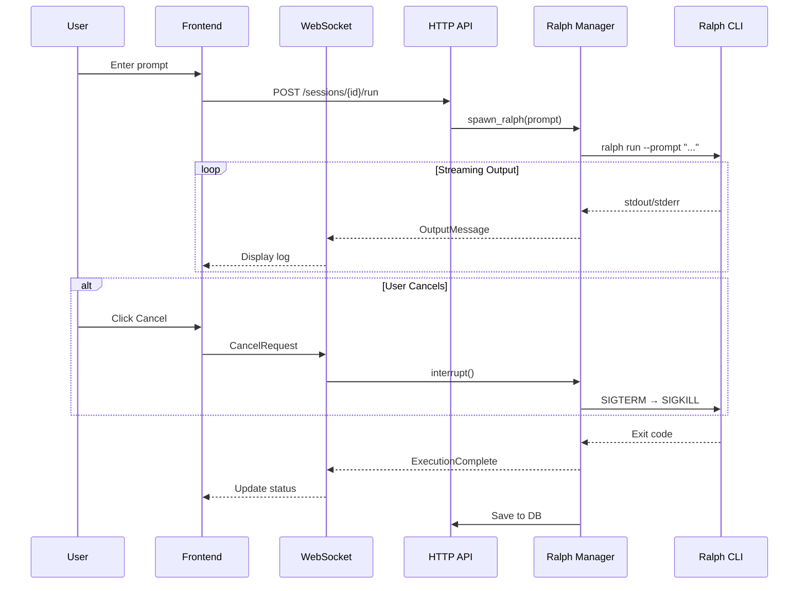

# Detailed Design: Ralphtown

## 1. Overview

This document describes the design for Ralphtown - a web UI for the Ralph CLI orchestrator that enables users to interact with AI coding agents through a browser interface. The system allows users to send prompts that execute Ralph commands, view real-time output, manage repositories, and control execution flow.

### Goals
- Provide a web UI for interacting with Ralph AI orchestration
- Stream real-time console output from Ralph executions
- Support all Ralph commands (run, resume, plan, task, events, clean)
- Enable repository management (local paths, clone from URL)
- Provide git command shortcuts (status, log, push, pull, reset, branch, commit)
- Support interrupt/cancel of running executions
- Persist session history and configuration in SQLite
- Easy installation via `cargo install` with optional system service

### Non-Goals
- Multi-user authentication (local-only for MVP)
- Remote server deployment (architecture supports it, but not implemented)
- In-depth code diff viewing (only file names + delta counts)

---

## 2. Detailed Requirements

### 2.1 Deployment & Installation
- **Local-only deployment**: UI and backend run on user's machine
- **Easy installation**: Single `cargo install ralphtown` command
- **Service management**: Optional auto-start via native platform services
  - macOS: launchd (LaunchAgent)
  - Linux: systemd (user service)
  - Windows: Windows Service
- **Uninstall**: Accessible via UI settings or CLI command
- **Architecture**: Designed to support future server-based deployment

### 2.2 Ralph Command Support
Full support for all Ralph CLI commands:
| Command | UI Interaction |
|---------|----------------|
| `ralph run` | Send prompt, execute autonomously |
| `ralph resume` | Continue previous session |
| `ralph plan` | Interactive PDD planning session |
| `ralph task` | Generate code tasks |
| `ralph events` | View event history |
| `ralph clean` | Remove .agent/ artifacts |

### 2.3 Conversation Model
- **One-shot per message**: User sends prompt → Ralph runs to completion → User can send another
- **Blocking during execution**: No new messages while Ralph is running
- **Interrupt/Cancel**: User can stop execution mid-run if output looks wrong
- **Git commands**: Available anytime via UI buttons

### 2.4 Output Display
- **Primary**: Real-time console log stream (stdout/stderr)
- **Secondary**: File changes panel showing:
  - File names only (no full diffs)
  - Lines added (green) / removed (red) counts
- **No detailed code inspection** in UI

### 2.5 Repository Management
- **Selection methods**:
  - Connect to local filesystem path
  - Clone from Git URL
- **Pre-configured list**: Scannable directories for easy selection
- **Constraint**: Maximum 1 Ralph instance per repository

### 2.6 Git Commands
UI buttons for common git operations:
| Command | Confirmation Required |
|---------|----------------------|
| `git status` | No |
| `git log` (recent) | No |
| `git branch` | No |
| `git pull` | No |
| `git push` | No |
| `git commit` | No (but requires message input) |
| `git reset --hard` | **Yes** (destructive) |

### 2.7 Configuration
- **Sensible defaults** out of the box
- **Power user options** via settings panel:
  - AI backend selection (Claude, Gemini, etc.)
  - Ralph presets (tdd-red-green, feature, debug, etc.)
  - Max iterations
  - Custom ralph.yml path

### 2.8 Persistence
- **SQLite database** for:
  - Session history and conversation logs
  - Repository list and recent selections
  - User configuration and preferences
  - Service installation state

### 2.9 Project Structure
- **Monorepo** layout:
  ```
  ralphtown/
  ├── frontend/     # React/TypeScript UI
  ├── backend/      # Rust backend server
  └── Cargo.toml    # Workspace manifest
  ```

---

## 3. Architecture Overview

### 3.1 System Architecture



### 3.2 Data Flow



### 3.3 Component Overview

| Component | Technology | Responsibility |
|-----------|------------|----------------|
| Frontend | React + TypeScript + Vite | UI, WebSocket client |
| HTTP API | Axum | REST endpoints, session management |
| WebSocket Server | Axum (tokio-tungstenite) | Real-time streaming, bidirectional |
| Ralph Manager | tokio::process | Spawn/monitor/interrupt Ralph |
| Git Manager | git2 + CLI subprocess | Git operations |
| Database | rusqlite | Persistence |
| Service Manager | service-manager crate | Install/uninstall system service |

---

## 4. Components and Interfaces

### 4.1 Backend API

#### HTTP Endpoints

```
# Sessions
POST   /api/sessions                    Create new session for repo
GET    /api/sessions                    List all sessions
GET    /api/sessions/{id}               Get session details
DELETE /api/sessions/{id}               Delete session

# Ralph Commands
POST   /api/sessions/{id}/run           Execute ralph run
POST   /api/sessions/{id}/resume        Execute ralph resume
POST   /api/sessions/{id}/plan          Execute ralph plan
POST   /api/sessions/{id}/task          Execute ralph task
GET    /api/sessions/{id}/events        Get ralph events
POST   /api/sessions/{id}/clean         Execute ralph clean

# Git Commands
GET    /api/sessions/{id}/git/status    Get git status
GET    /api/sessions/{id}/git/log       Get recent commits
GET    /api/sessions/{id}/git/branches  List branches
POST   /api/sessions/{id}/git/pull      Execute git pull
POST   /api/sessions/{id}/git/push      Execute git push
POST   /api/sessions/{id}/git/commit    Execute git commit
POST   /api/sessions/{id}/git/reset     Execute git reset --hard
POST   /api/sessions/{id}/git/checkout  Switch branch

# Repositories
GET    /api/repos                       List configured repos
POST   /api/repos                       Add repo (local path or clone URL)
DELETE /api/repos/{id}                  Remove repo from list
POST   /api/repos/scan                  Scan directories for repos

# Configuration
GET    /api/config                      Get current config
PUT    /api/config                      Update config
GET    /api/config/presets              List available Ralph presets
GET    /api/config/backends             List available AI backends

# Service Management
GET    /api/service/status              Get service installation status
POST   /api/service/install             Install as system service
POST   /api/service/uninstall           Uninstall system service
POST   /api/service/start               Start service
POST   /api/service/stop                Stop service
```

#### WebSocket Protocol

Connection: `ws://localhost:3000/api/ws`

**Client → Server Messages:**
```typescript
// Subscribe to session output
{ "type": "subscribe", "session_id": "uuid" }

// Cancel running execution
{ "type": "cancel", "session_id": "uuid" }

// Unsubscribe from session
{ "type": "unsubscribe", "session_id": "uuid" }
```

**Server → Client Messages:**
```typescript
// Console output (stdout/stderr)
{
  "type": "output",
  "session_id": "uuid",
  "stream": "stdout" | "stderr",
  "content": "string",
  "timestamp": "ISO8601"
}

// Execution status change
{
  "type": "status",
  "session_id": "uuid",
  "status": "running" | "completed" | "cancelled" | "error",
  "exit_code": number | null,
  "timestamp": "ISO8601"
}

// File change detected
{
  "type": "file_change",
  "session_id": "uuid",
  "files": [
    { "path": "src/main.rs", "added": 50, "removed": 10 }
  ]
}

// Error
{
  "type": "error",
  "session_id": "uuid",
  "message": "string"
}
```

### 4.2 Ralph Manager

```rust
pub struct RalphManager {
    processes: HashMap<Uuid, RalphProcess>,
    db: Arc<Database>,
}

pub struct RalphProcess {
    session_id: Uuid,
    child: Child,
    working_dir: PathBuf,
    status: ProcessStatus,
    output_tx: broadcast::Sender<OutputMessage>,
}

impl RalphManager {
    /// Spawn a new ralph run
    pub async fn run(
        &mut self,
        session_id: Uuid,
        prompt: String,
        config: RalphConfig,
    ) -> Result<broadcast::Receiver<OutputMessage>>;

    /// Resume from scratchpad
    pub async fn resume(
        &mut self,
        session_id: Uuid,
        config: RalphConfig,
    ) -> Result<broadcast::Receiver<OutputMessage>>;

    /// Execute ralph plan
    pub async fn plan(
        &mut self,
        session_id: Uuid,
        idea: Option<String>,
    ) -> Result<broadcast::Receiver<OutputMessage>>;

    /// Execute ralph task
    pub async fn task(
        &mut self,
        session_id: Uuid,
        input: Option<String>,
    ) -> Result<broadcast::Receiver<OutputMessage>>;

    /// Get events from .agent/events.jsonl
    pub async fn events(
        &self,
        session_id: Uuid,
        filter: EventFilter,
    ) -> Result<Vec<RalphEvent>>;

    /// Clean .agent directory
    pub async fn clean(&self, session_id: Uuid) -> Result<()>;

    /// Interrupt running process
    pub async fn interrupt(&mut self, session_id: Uuid) -> Result<()>;

    /// Check if repo already has running instance
    pub fn is_repo_busy(&self, repo_path: &Path) -> bool;
}
```

### 4.3 Git Manager

```rust
pub struct GitManager;

impl GitManager {
    /// Get repository status
    pub fn status(repo_path: &Path) -> Result<GitStatus>;

    /// Get recent commit log
    pub fn log(repo_path: &Path, limit: usize) -> Result<Vec<Commit>>;

    /// List branches
    pub fn branches(repo_path: &Path) -> Result<Vec<Branch>>;

    /// Execute git pull
    pub async fn pull(repo_path: &Path) -> Result<String>;

    /// Execute git push
    pub async fn push(repo_path: &Path) -> Result<String>;

    /// Execute git commit
    pub async fn commit(repo_path: &Path, message: &str) -> Result<String>;

    /// Execute git reset --hard
    pub async fn reset_hard(repo_path: &Path) -> Result<String>;

    /// Switch branch
    pub async fn checkout(repo_path: &Path, branch: &str) -> Result<String>;

    /// Clone repository
    pub async fn clone(url: &str, dest: &Path) -> Result<PathBuf>;

    /// Get file changes (for delta display)
    pub fn diff_stats(repo_path: &Path) -> Result<Vec<FileDelta>>;
}

pub struct FileDelta {
    pub path: String,
    pub added: usize,
    pub removed: usize,
}
```

### 4.4 Service Manager

```rust
pub struct ServiceController {
    manager: Box<dyn ServiceManager>,
}

impl ServiceController {
    /// Check if service is installed
    pub fn is_installed(&self) -> Result<bool>;

    /// Check if service is running
    pub fn is_running(&self) -> Result<bool>;

    /// Install as system service
    pub fn install(&self, config: ServiceConfig) -> Result<()>;

    /// Uninstall system service
    pub fn uninstall(&self) -> Result<()>;

    /// Start service
    pub fn start(&self) -> Result<()>;

    /// Stop service
    pub fn stop(&self) -> Result<()>;

    /// Get service status
    pub fn status(&self) -> Result<ServiceStatus>;
}

pub struct ServiceConfig {
    pub run_on_startup: bool,
    pub port: u16,
}
```

---

## 5. Data Models

### 5.1 Database Schema

```sql
-- Sessions table
CREATE TABLE sessions (
    id TEXT PRIMARY KEY,
    repo_id TEXT NOT NULL REFERENCES repos(id),
    title TEXT,
    status TEXT NOT NULL DEFAULT 'idle',  -- idle, running, completed, error, cancelled
    created_at TEXT NOT NULL,
    updated_at TEXT NOT NULL,
    last_command TEXT,
    last_exit_code INTEGER
);

-- Conversation messages
CREATE TABLE messages (
    id TEXT PRIMARY KEY,
    session_id TEXT NOT NULL REFERENCES sessions(id),
    role TEXT NOT NULL,  -- user, system, ralph
    content TEXT NOT NULL,
    timestamp TEXT NOT NULL
);

-- Console output logs
CREATE TABLE output_logs (
    id INTEGER PRIMARY KEY AUTOINCREMENT,
    session_id TEXT NOT NULL REFERENCES sessions(id),
    stream TEXT NOT NULL,  -- stdout, stderr
    content TEXT NOT NULL,
    timestamp TEXT NOT NULL
);

-- Repositories
CREATE TABLE repos (
    id TEXT PRIMARY KEY,
    path TEXT NOT NULL UNIQUE,
    name TEXT NOT NULL,
    source TEXT NOT NULL,  -- local, cloned
    clone_url TEXT,
    default_branch TEXT,
    created_at TEXT NOT NULL,
    last_used_at TEXT
);

-- Configuration
CREATE TABLE config (
    key TEXT PRIMARY KEY,
    value TEXT NOT NULL
);

-- Scan directories (for repo discovery)
CREATE TABLE scan_dirs (
    id TEXT PRIMARY KEY,
    path TEXT NOT NULL UNIQUE,
    enabled INTEGER NOT NULL DEFAULT 1
);
```

### 5.2 TypeScript Types (Frontend)

```typescript
interface Session {
  id: string;
  repoId: string;
  title: string | null;
  status: 'idle' | 'running' | 'completed' | 'error' | 'cancelled';
  createdAt: Date;
  updatedAt: Date;
  lastCommand: string | null;
  lastExitCode: number | null;
}

interface Message {
  id: string;
  sessionId: string;
  role: 'user' | 'system' | 'ralph';
  content: string;
  timestamp: Date;
}

interface Repository {
  id: string;
  path: string;
  name: string;
  source: 'local' | 'cloned';
  cloneUrl: string | null;
  defaultBranch: string | null;
  createdAt: Date;
  lastUsedAt: Date | null;
}

interface GitStatus {
  branch: string;
  ahead: number;
  behind: number;
  staged: FileStatus[];
  unstaged: FileStatus[];
  untracked: string[];
}

interface FileStatus {
  path: string;
  status: 'added' | 'modified' | 'deleted' | 'renamed';
}

interface FileDelta {
  path: string;
  added: number;
  removed: number;
}

interface Config {
  backend: string;
  preset: string | null;
  maxIterations: number;
  customConfigPath: string | null;
  scanDirectories: string[];
  serviceEnabled: boolean;
  port: number;
}
```

### 5.3 Rust Types (Backend)

```rust
#[derive(Debug, Clone, Serialize, Deserialize)]
pub struct Session {
    pub id: Uuid,
    pub repo_id: Uuid,
    pub title: Option<String>,
    pub status: SessionStatus,
    pub created_at: DateTime<Utc>,
    pub updated_at: DateTime<Utc>,
    pub last_command: Option<String>,
    pub last_exit_code: Option<i32>,
}

#[derive(Debug, Clone, Copy, Serialize, Deserialize)]
#[serde(rename_all = "lowercase")]
pub enum SessionStatus {
    Idle,
    Running,
    Completed,
    Error,
    Cancelled,
}

#[derive(Debug, Clone, Serialize, Deserialize)]
pub struct Repository {
    pub id: Uuid,
    pub path: PathBuf,
    pub name: String,
    pub source: RepoSource,
    pub clone_url: Option<String>,
    pub default_branch: Option<String>,
    pub created_at: DateTime<Utc>,
    pub last_used_at: Option<DateTime<Utc>>,
}

#[derive(Debug, Clone, Copy, Serialize, Deserialize)]
#[serde(rename_all = "lowercase")]
pub enum RepoSource {
    Local,
    Cloned,
}

#[derive(Debug, Clone, Serialize, Deserialize)]
pub struct RalphConfig {
    pub backend: String,
    pub preset: Option<String>,
    pub max_iterations: u32,
    pub custom_config_path: Option<PathBuf>,
}
```

---

## 6. Error Handling

### 6.1 Error Categories

| Category | HTTP Status | Handling |
|----------|-------------|----------|
| Validation | 400 | Return specific field errors |
| Not Found | 404 | Resource doesn't exist |
| Conflict | 409 | Repo already has running instance |
| Process Error | 500 | Ralph/Git command failed |
| Internal | 500 | Unexpected server error |

### 6.2 Error Response Format

```typescript
interface ErrorResponse {
  error: {
    code: string;
    message: string;
    details?: Record<string, string>;
  };
}
```

### 6.3 Graceful Degradation

- **Ralph not installed**: Clear error message with installation instructions
- **Git not installed**: Disable git features, show warning
- **Database corruption**: Attempt recovery, offer reset option
- **WebSocket disconnect**: Auto-reconnect with exponential backoff
- **Process crash**: Capture last output, mark session as error

---

## 7. Testing Strategy

### 7.1 Philosophy

**Keep tests minimal and focused on complex business logic.** Tests should verify correctness of non-trivial logic without being overkill. Avoid testing trivial code paths, framework behavior, or simple CRUD operations.

### 7.2 What to Test

Focus testing efforts on:
- **Process management logic** - Signal handling, process group management, interrupt flow
- **State machine transitions** - Session status changes (idle → running → completed/error/cancelled)
- **Repo busy detection** - Ensuring 1 instance per repo constraint
- **Git diff parsing** - Extracting file deltas correctly
- **Configuration validation** - Ensuring valid config before Ralph execution
- **WebSocket message serialization** - Correct message format for frontend

### 7.3 What NOT to Test

Skip tests for:
- Simple getters/setters
- Direct database CRUD (trust rusqlite)
- Axum routing (trust the framework)
- Straightforward pass-through functions

### 7.4 Test Approach

| Area | Approach |
|------|----------|
| Ralph Manager | Test interrupt logic, process group signals, busy detection |
| Git Manager | Test diff stat parsing, status parsing |
| State Transitions | Test session status state machine |
| WebSocket Protocol | Test message serialization/deserialization |

### 7.5 Example Test Scenarios

```rust
// Test: Cannot start ralph on repo that's already running
#[test]
fn test_repo_busy_detection() { ... }

// Test: Interrupt sends SIGTERM then SIGKILL after timeout
#[test]
fn test_interrupt_signal_sequence() { ... }

// Test: Session transitions from running to cancelled on interrupt
#[test]
fn test_session_status_on_cancel() { ... }

// Test: Git diff stats parsed correctly
#[test]
fn test_parse_diff_stats() { ... }
```

---

## 8. Appendices

### Appendix A: Technology Choices

| Component | Choice | Alternatives Considered |
|-----------|--------|------------------------|
| Web Framework | Axum | Actix Web (more complex), Warp (smaller ecosystem) |
| WebSocket | Axum built-in | tokio-tungstenite directly |
| Database | rusqlite | SQLx (overkill for sync SQLite), Diesel (too heavy) |
| Git Library | git2 + CLI hybrid | Pure git2 (missing some features), Pure CLI (error-prone) |
| Service Manager | service-manager crate | uni_service_manager, manual implementation |
| Process Management | tokio::process | std::process (no async) |

### Appendix B: Security Considerations

- **Local-only**: No authentication needed for MVP (localhost only)
- **Path validation**: Sanitize all file paths to prevent traversal
- **Command injection**: Never interpolate user input into shell commands
- **Confirmation dialogs**: Required for destructive operations (reset --hard)
- **Future server mode**: Will require authentication layer

### Appendix C: Performance Considerations

- **Output buffering**: Batch WebSocket messages to avoid flooding
- **Database**: Use WAL mode for SQLite concurrent access
- **Process limits**: Cap concurrent Ralph instances (1 per repo already enforced)
- **Log rotation**: Limit stored output logs per session

### Appendix D: Future Extensibility

The architecture supports future enhancements:
- **Server mode**: Abstract API layer can be deployed remotely
- **Multi-user**: Add authentication middleware
- **Additional backends**: Plug in new AI backends via configuration
- **Plugins**: Extend git commands or add new managers
